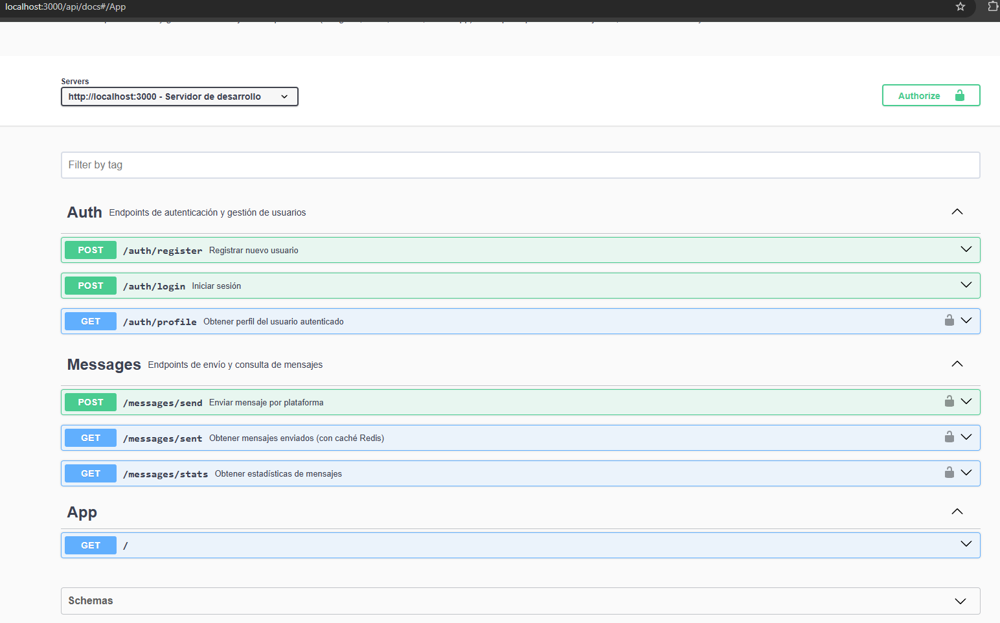
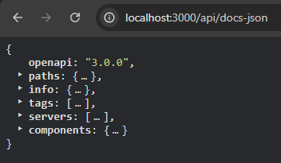

# Backend MOOB - NestJS + MongoDB + TypeScript + Swagger + Redis + Multer + Cloudinary

Backend desarrollado en NestJS para Moob Challenge, para la base de datos utilice MnogoDB Atlas para crear un cluster y atraves de MongoDB Compass poder conectarla al proyecto. Utilice TypesCript para obtener tipado fuerte y no obtener errores por la falta del mismo. Para la autenticacion de los usuarios utilice JWT y encriptacion de la contraceña. A la hora de generar un sistema de loggin utilice la funcionalidad Logger que provee nestjs/common. Durante el desarrollo utilice patrones de diseño como Factory combinado con Strategy que recibe una plataforma y que estrategia devuelve.

Para el manejo de archivos utilice el middleware multer de Express para poder manejarlos como multipart/form-data para luego enviarselo a cloudinary y de esta forma envie la fileURL que guardamos en la DB y que sea accesible desde el frontend. A la hora de implementar un servicio de mensajeria real opte por integrar el chatBot de Telegram el cual permite enviar mensajes con y sin archivo sin ningun tipo de problemas y desde la misma aplicacion se puede descargar el archivo.

Por ultimo yendo al tema de almacenamiento de los mensajes, implemente un sistema de cache con invalidacion manual. Este sistema lo lleve acabo utilizando redis lo cual me permite consultar la DB y cargar la cache con los datos para que no tengamos que hacer llamados constantes a la DB y a la hora de que escale la misma no se vuelva lento el funcionamiento. El formato de inavalidacion manual me permite generar un keyName de la cache el cual dura 24 horas o si hay una modificacion en los datos de la DB este key se regenera para cargar la cache con la nueva informacion.

Por ultimo cree test sobre el back para probar porcentaje de testing y poder ver el uso de las funciones y su comportamiento tanto en casos favorables como en los casos contrarios, esto me permitio poder ver que datos retornabamos en cada caso.

---

## 🚀 Tecnologías principales

- **NestJS 11**
- **MongoDB Atlas** (a través de Mongoose)
- **Redis** (caché de mensajes)
- **Cloudinary** (almacenamiento de archivos)
- **Swagger** (documentación de API)
- **Jest** (testing unitario)
- **Docker** (para Redis local)
- **Multer** (manejo de archivos `multipart/form-data`)

---

### User Schema

**Ubicación:** `src/users/schemas/user.schema.ts`

**Campos:**

- `username`: string, único, 3-30 caracteres
- `email`: string, único, validación de formato
- `password`: string, mínimo 7 caracteres
- `createdAt`, `updatedAt`: automáticos

**Características:**

- ✅ Índices únicos automáticos
- ✅ Password excluido en respuestas JSON
- ✅ Timestamps automáticos

### Message Schema

**Ubicación:** `src/messages/schemas/message.schema.ts`

**Campos:**

- `senderId`: ObjectId → referencia a User
- `recipients`: string[] (mínimo 1)
- `platform`: enum (telegram, slack, discord, whatsapp)
- `content`: string, 1-5000 caracteres
- `file`: objeto opcional (name, path, type, size)
- `sent`, `delivered`: boolean (default: false)
- `createdAt`, `updatedAt`: automáticos

---

## Instalación y configuración

1. Clonar el repositorio:
   git clone https://github.com/AgustinMurad/backendMoob
   cd messages-api

2. Instalar dependencias:
   npm install

3. Archivo `.env`

4. Levantar Redis:
   docker run -d -p 6379:6379 redis

5. Iniciar servidor
   npm run start:dev

---

## Documentación de API

Una vez corriendo, podés acceder a la documentación Swagger en:
http://localhost:3000/api/docs



Y al JSON en:
http://localhost:3000/api/docs-json



---

## Patrones de diseño aplicados

Se utilizó el patrón Factory + Strategy para el envío de mensajes:

MessageSenderFactory: selecciona la estrategia adecuada según la plataforma.
Estrategias concretas (TelegramSender, SlackSender, etc.) implementan la interfaz MessageSender.

---

## Cache con Redis

Los mensajes enviados se almacenan temporalmente en Redis, asociados al userId.
Cada vez que se envía o elimina un mensaje, se invalida manualmente la caché
para mantener sincronización con la base de datos.

---

## Testing

Se incluyeron tests unitarios con Jest para los servicios principales:

AuthService (registro y login con JWT)
MessageService (envío de mensajes y manejo de errores)

El enfoque es demostrar dominio del testing unitario y uso de mocks.

**Comandos**

```bash
#Test
npm run test

#Coverage
npm run test:cov
```

---

## Manejo de archivos

1. Los archivos se reciben como multipart/form-data mediante Multer.
2. Se suben a Cloudinary utilizando su API REST.
3. Se guarda en la base solo la secure_url devuelta por Cloudinary.
4. El frontend renderiza esa URL directamente

---

## Qué Tiene el Proyecto

✅ **Configuración de MongoDB** con Mongoose
✅ **Schema User** con validaciones
✅ **Schema Message** con referencias y enum

---

## Comandos

```bash
# Build
npm run build

# Desarrollo
npm run start:dev

# Producción
npm run start:prod

#Test
npm run test

#Coverage
npm run test:cov
```

---

### Autor

Desarrollado por Agustín Murad
Challenge técnico — MOOB Club
